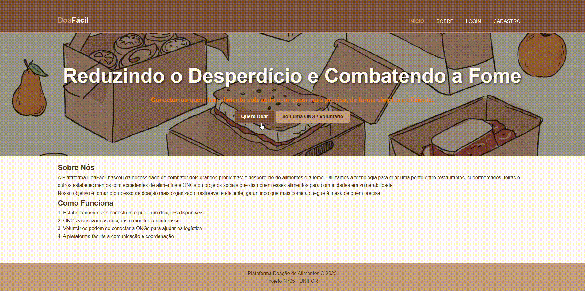

## 📘 Projeto Multiplataforma unifor

Este é um projeto Full Stack composto por uma API (Node.js) e um front-end (Html+Css). O objetivo é desenvolver uma Plataforma de Doação de Alimentos, um sistema multiplataforma que vai conectar lugares com comida sobrando a ONGs e comunidades que precisam.

---

Cada pasta possui seu próprio `README.md` com instruções específicas.

## 📄 Documentação por seção

- 📄 [Documentação de arquitetura detalhado](./docs/AtivParcial%20-%20PROJETO%20APLIC.%20MULTIPLATAFORMA%20ETAPA%201.pdf)
- 📦 [Documentação do Back-end](./back-end/README.md)
- 🖼 [Documentação do Front-end](./front-end/README.md)

---

## Projeto



## Apresentaçãopo para o publico alvo

- 📄 [Apresentação da plataforma](./docs/apresentação%20do%20projeto.pdf)

## ✅ Pré-requisitos

- Node.js v18+
- npm ou yarn
- Banco de dados PostgreSQL (ou outro)
- (opcional) Docker (se usar)

---

## 👨‍💻 Autores

- **[Alanna Mércia]** - ([@alanna-mercia](https://github.com/alanna-mercia))
- **[Caio Ruan]** - ([@CaioRuanCarv](https://github.com/CaioRuanCarv))
- **[Jonas Tiago]** - ([@JonasTiago](https://github.com/JonasTiago))
- **[Lizandra Raquel]** - ([@LizandraRaquel](https://github.com/LizandraRaquel))
- **[Laiza Fernandes]** - ([@uxlaaiza](https://github.com/uxlaaiza))
- **[Maria Lindayse]** - ([@MariaLindayse](https://github.com/MariaLindayse))

---

## 📁 Estrutura do Projeto

```

/projeto-fullstack
│
├── front-end/     # Aplicação React
├── back-end/      # API Node.js com Prisma
├── README.md      # Este arquivo

```

## 📄 Licença

Este projeto está sob a licença MIT.

```

```
